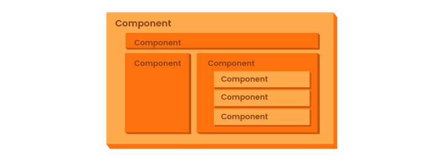

# React One

This is the lecture repo used for React One. In this we will go over what React is, what it is used for, and how to get started.

## What Is React?

React is a Javascript library that was created and is maintained by Facebook. React is used to manage the DOM and create a highly performant user interfaces and front end applications.

Some popular websites that use React are:

- Instagram

- Netflix

- Imgur

- Tesla

- Venmo

## Why Use React?

React makes front end Javascript development much easier.

Uses JSX.

Utilizes something called `components` that are self contained pieces of the application.

These components make up the `component based architecture` for our application

## Component Based Architecture

Component based architecture is where an application uses components to make up each part of our application. This creates orginzation in our code and an understanding on how to layout our components in our application.



## Virtual DOM

The `Virtual DOM` is a light weight copy of the actual DOM. The Virtual DOM is the representation we will be using to update our user interface in React. Anytime their is a change to the Virtual DOM, it will go through a process called `reconciliation`. This is where it compares itself to the actual DOM to see if there has been any changes, and if there has been then it will update the actual DOM only at the part that needs to be updated.


## Get Started

We will get started by using the command line application `create-react-app` to quickly make a React application. Create react app is a bootstrapping tool that helps developer easily get off the ground and started with a React project.

We first need to gloably install `create-react-app` onto our machines.

In the terminal run:

```bash
$ npm install -g create-react-app
```

The `-g` is what is known as a flag, it pretty much just says to install this globaly to our machine so we can use it anywhere.

After installing create react app, go ahead an create a new react project by running:

```bash
$ create-react-app name-of-app
```

## Components

Components are the building blocks of a React application.

A component is either a class or a function that will return a React element that will describe how a section of the user interface will be displayed and interacted with.

> Note: it's important to keep in mind that components need to start with an uppercase letter


### Functional Component

A functional component is a simple component or sometimes refered to as a `dumb component`. That is because a functional component can not hold any local state values to it, it's meant to just receive data and return a React element.

```javascript
import React from "react";

const DumbComponent = () => <h1>Hello, I'm a functional component</h1>;

export default DumbComponent;
```

### Class Component

A class component is a complex component or sometimes refered to as a `smart component`. That is because a class component can hold local state value and we can also write logic to manipulate those state values. A class component will still return a React element.

```javascript
import React from "react";

class SmartComponent extends React.Component {
  // render method
  render() {
    return <h1>Hello, I'm a class component</h1>;
  }
}

export default SmartComponent;
```

Above, notice that we have a method called `render`. This method is where we will choose what elements to return to make up the React element. This is the part of the component that is known as `JSX`.

### JSX

The tag syntax inside of a component is not a string or HTML. It's called `JSX`, which is a syntax extension to Javascript. JSX produces React "elements" that describe how the user interface should appear for that React element. This looks very familiar to HTML, so if you are comfortable with that, then it should be easy to get the hang of.

```jsx
<div>
    <h1>This is JSX</h1>
    <p>It looks very similar to HTML, but it is not HTML. It is an extension of Javascript that helps us create the UI of a component</p>
</div>
```

